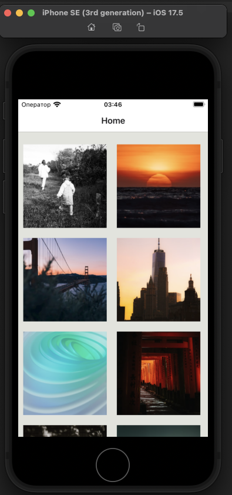

# Приложение:
Тестовое приложение "Галерея изобрежений".  
Выполнено в качестве тестового задания для оценки командой "Кавер".  
В качестве API использован сервис [Unsplash]([https://unsplash.com/]).  
# Функционал в приложении:
- Бесконечная лента случайных изображений.
- Обновление списка с помощью свайпа вверх.
- Переход в карточку с информацией о фото.

# Используемый стек:
Node.JS 22.2 (Минимальная версия: 18)  
Type Script 5.0.4  

React Native 0.74.2  (Без Expo Framework)
React-Navigation 6.1.17  
Mobx 6.12.3  
Axios 1.7.2  

# Структура проекта:
src - Исходный код проекта.
- assets - Картинки для проекта (Плэйсхолдер)
- components - Папка с React компонентами приложения
- app.tsx - Корневой компонент проекта.
- mainStore.tsx - Главный стор проекта.

# Локальный запуск:
Настроить локальный ПК для запуска:
1. https://reactnative.dev/docs/set-up-your-environment (Выбрать используемую платформу и настроить окружение)
2. Скачать проект. Открыть консоль, перейти в папку с проектом
3. `npm start`
4. `i`
5. Дождаться загрузки симулятора и сборки приложения

# Проблемы:  
#### Q: Приложение самопроизвольно отказывается загружать картинки. Интернет работает.
##### A: Произошло ограничение по количеству запросов (50 в час). Подождите, либо - установите свой ключ.  
#### Q: Не удается установить cocoaPods по инструкции с проекта.
##### A: Помог следующий гайд по установке cocoaPods.
`https://stackoverflow.com/a/25257238` 
#### Q: Использование своего API ключа.
##### A: Ключ хранится в константе, в корневом компоненте:
`/App.tsx (API_ACCESS_KEY)`

#### Q: Как запустить проект без Expo на устройстве?
##### A: Инструкция с проекта React Native.
`https://reactnative.dev/docs/running-on-device`